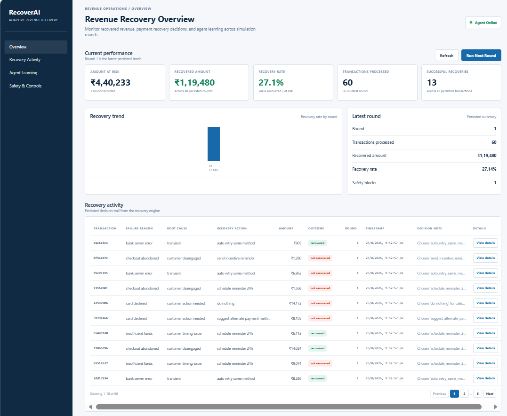
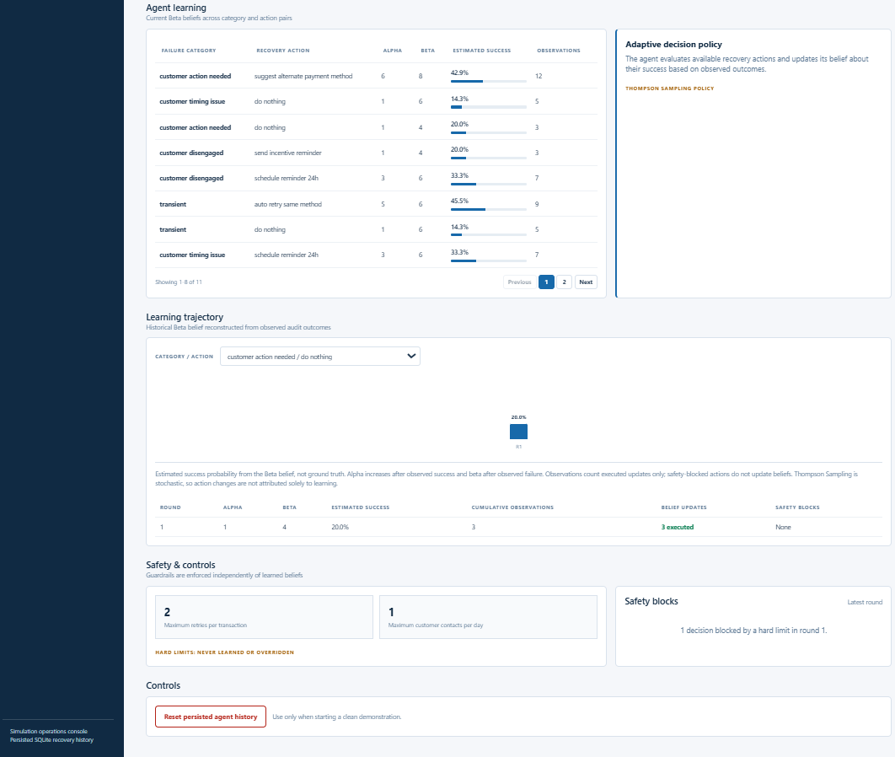
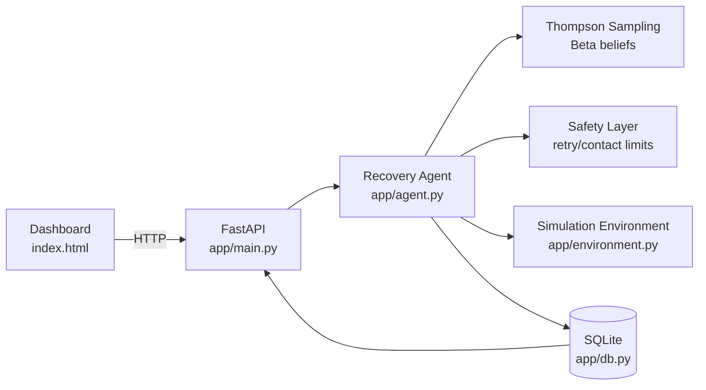

# RecoverAI — Adaptive Revenue Recovery Agent

RecoverAI is an adaptive recovery agent for failed and abandoned payment events.
It maps failure reasons to possible recovery actions, selects among them with
Thompson Sampling, executes the selected action in a simulated environment, and
learns from the observed outcome. Hard retry and customer-contact limits are
enforced separately from the learned policy.

This repository is an engineering challenge prototype for Razorpay AI Revenue
Recovery. It demonstrates the decision loop and its auditability; it does not
connect to a live payment provider.

## Current Scope

RecoverAI is a prototype and simulation environment. It currently demonstrates
synthetic failed-payment generation, cause-specific candidate actions,
Thompson-Sampling decisions, hard safety controls, simulated outcomes, SQLite
persistence, and an inspectable browser console. It is not a production payment
recovery integration and does not process live customer or Razorpay data.

## Dashboard Preview





## Problem

Different payment failures call for different responses. A transient network
or bank error may justify a retry, while insufficient funds, an OTP failure, a
card decline, or an abandoned checkout may need a customer action. The system
also needs to know when to stop retrying or contacting a customer.

RecoverAI treats recovery as a bounded decision problem: choose an action whose
expected recovered value justifies its configured cost, while always respecting
hard safety limits.

## How RecoverAI Works

```text
Failed Payment
        |
Diagnosis from failure_reason
        |
Candidate Actions
        |
Thompson-Sampling Decision
        |
Hard Safety Checks
        |
Simulated Execution
        |
Observe Outcome
        |
Update Beta Belief
        |
Persist Decision and Audit Trail
```

`POST /api/run-round` generates a fresh synthetic batch, defaulting to 60
events. For each event, `app/agent.py` maps the failure reason to a category,
evaluates candidate actions, samples a success probability for each action,
and chooses the highest expected net value. Contact actions also receive a
soft cost based on contacts already made that day. A hard safety check runs
before execution.

The supported failure reasons and candidate actions are:

| Failure reason | Category | Candidate actions |
| --- | --- | --- |
| `network_timeout`, `bank_server_error` | `transient` | `auto_retry_same_method`, `do_nothing` |
| `otp_failed` | `customer_retry_needed` | `prompt_retry_otp`, `do_nothing` |
| `insufficient_funds` | `customer_timing_issue` | `schedule_reminder_24h`, `do_nothing` |
| `card_declined` | `customer_action_needed` | `suggest_alternate_payment_method`, `do_nothing` |
| `checkout_abandoned` | `customer_disengaged` | `send_incentive_reminder`, `schedule_reminder_24h`, `do_nothing` |

## Thompson Sampling / Learning

Each category/action pair starts with a Beta(1,1) belief. `alpha` represents
success evidence and `beta` represents failure evidence, including the initial
prior value of 1 in each parameter.

For every candidate action, the agent samples a probability from its current
Beta belief. It multiplies that sample by the transaction amount, subtracts
the action cost and any soft contact cost, and selects the largest expected net
value. After a successful simulated action, `alpha` increases by one. After a
failed action, `beta` increases by one. A safety-blocked action is not executed
and does not update the belief.

## Safety Layer

The learned policy cannot override these hard controls:

- Maximum retries per transaction: `2`.
- Maximum customer contacts per day: `1`.
- Contact actions covered by the ceiling: `prompt_retry_otp`,
  `schedule_reminder_24h`, and `send_incentive_reminder`.

If the selected action violates a limit, the agent records a
`not_attempted` outcome, marks `blocked_by_safety_limit` as true, stores the
reason, and makes no fallback attempt or belief update.

## Audit Trail

SQLite stores three tables in `data/recovery_agent.db`:

- `beliefs`: current `alpha` and `beta` for each category/action pair.
- `audit_log`: transaction and customer identifiers, amount, failure reason,
  category, selected action, evidence, candidates considered, expected outcome,
  actual outcome, recovered amount, safety decision, explanation, belief
  update, timestamp, and round.
- `customer_contacts`: contact count by customer and date.

The audit record makes each decision inspectable, including what the agent knew,
what it considered, why it selected an action, and whether execution was
blocked. The reset endpoint clears all three tables for a clean demonstration.

## Dashboard

`dashboard/index.html` is an operations/recovery monitoring console. It includes:

- **Current Performance**: amount at risk, recovered amount, recovery rate,
  processed transactions, and successful recoveries.
- **Recovery Trend**: recovery rate by persisted round.
- **Latest Round**: summary of the latest batch and its safety blocks.
- **Recovery Activity**: paginated transaction decisions with expandable audit
  details.
- **Agent Learning**: current category/action beliefs, estimated success, and
  observations.
- **Learning Trajectory**: historical Beta belief values reconstructed from
  persisted audit outcomes.
- **Adaptive Decision Policy**: the policy explanation shown by the console.
- **Safety & Controls**: retry/contact ceilings, recent safety blocks, refresh,
  run-round, and reset controls.

## Architecture



`data/generate_data.py` supplies synthetic transaction events. The simulation
environment samples outcomes using hidden configured probabilities; the agent
observes only the resulting success or failure.

## Project Structure

```text
revenue-recovery-agent/
├── app/
│   ├── agent.py          # Decision policy, safety checks, execution, learning
│   ├── db.py             # SQLite schema and persistence functions
│   ├── environment.py   # Simulated outcomes and action definitions
│   └── main.py           # FastAPI application and routes
├── dashboard/
│   └── index.html        # Browser operations console
├── data/
│   ├── __init__.py
│   └── generate_data.py  # Synthetic failed-payment event generator
├── requirements.txt
└── README.md
```

The SQLite database and optional `data/transactions.json` are runtime/generated
artifacts, not application source components.

## Tech Stack

| Area | Technology |
| --- | --- |
| API | Python, FastAPI |
| Server | Uvicorn |
| Persistence | SQLite via Python's `sqlite3` module |
| Dashboard | HTML, CSS, vanilla JavaScript |
| Learning policy | Thompson Sampling with Beta beliefs |
| Input data | Python-generated synthetic events |

## Running Locally

From the repository root on Windows:

```powershell
python -m venv .venv
.venv\Scripts\activate
pip install -r requirements.txt
uvicorn app.main:app --reload --port 8000
```

With the API running, open `dashboard/index.html` directly in a browser. The
dashboard expects the API at `http://localhost:8000`. Use **Run Next Round** to
generate and process a batch.

To generate the optional standalone JSON input artifact:

```powershell
python data/generate_data.py
```

## Validation / Testing

The implementation supports these behavior checks:

- A transaction at the retry ceiling is blocked before simulated execution.
- A customer at the daily contact ceiling is blocked before another contact.
- A successful executed action increments `alpha`.
- A failed executed action increments `beta`.
- A safety-blocked action records no belief update.
- Persisted beliefs, audit history, and contact counts can be cleared through
  `POST /api/reset`.

No automated test suite is included in the repository; these are implementation
and development validation points rather than claims of benchmark performance.

## What Broke During Development

The main development work was making the decision trail inspectable and
verifying the boundary between optimization and safety. That included checking
the database contact-count interface used by the safety method, ensuring the
date is passed into the contact-limit check, and confirming that blocked
decisions do not execute or update learning evidence. The dashboard then gained
the activity audit details and learning-trajectory view without changing the
decision engine.

## Future Improvements

Possible extensions outside the current scope include:

- Razorpay test-mode or payment-provider sandbox integration.
- Richer failure diagnosis using provider response data.
- Evaluation against historical, labeled payment-recovery data.
- Additional recovery strategies and configurable action costs.
- Production authentication, authorization, monitoring, and deployment controls.
